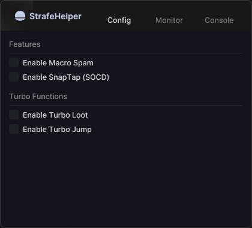
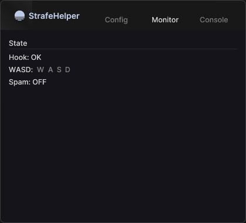
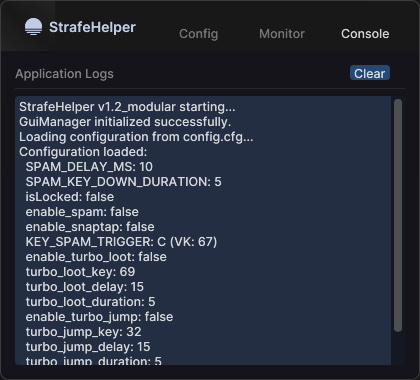

# StrafeHelper

## Motivation

The main motivation to create this project is to stop pay-to-cheat apps for macroing a simple thing. By providing a transparent, open-source alternative, this project aims to level the playing field and offer a free solution for the movement community.

## Technical Details

- **Language**: C++ (C++17 or later recommended).
- **Concurrency**: Utilizes multi-threaded logic and atomic operations (`std::atomic`) for thread-safe configuration management and input handling.
- **Input Simulation**:
  - Uses the Win32 `SendInput` API for keyboard event injection.
  - Implements low-level keyboard hooks (`WH_KEYBOARD_LL`) to monitor physical key states without latency.
- **Architecture**:
  - **SpamLogic & TurboLogic**: Handles the asynchronous timing and batching of simulated key presses.
  - **Config System**: Thread-safe loading and management of application parameters.
  - **GUI Integration**: A modern GUI layer powered by **Dear ImGui** over Win32 + DX11, completely isolated from the low-level keyboard hook to ensure zero-latency inputs while retaining a premium aesthetic.

## Previews

  
  

## Features

- **Modern UI**: Easily toggle features and monitor statuses through the stunning ImGui interface.
- **WASD Strafing**: Synchronized, rapid key simulation for movement keys to enable perfect strafes.
- **Dynamic Triggering**: Activation via a customizable trigger key (e.g., toggle or hold) including modern conveniences like *SnapTap*.
- **In-Memory Configuration**: Settings can be modified in real-time through the new ImGui Config Panel or directly via `config.cfg`.
- **Low Footprint**: Optimized to ensure minimal CPU and memory usage during gameplay.

## Getting Started

### Prerequisites

- Visual Studio 2022 or a compatible C++ compiler.
- Windows SDK.

### Build Instructions

1. Open `StrafeHelper.sln` in Visual Studio.
2. Set the build configuration to **Release** and architecture to **x64**.
3. Build the solution. The output binary will be located in the `x64/Release/` folder.

## Usage

1. Run the compiled executable `StrafeHelper.exe`.
2. The modern GUI will launch. You can configure your keybinds visually, use the console, and monitor your physical and simulated outputs in the State Monitor.
3. Use the configured trigger key to activate the strafe logic in-game.

## Disclaimer

This tool is for educational and personal use. Always respect the terms of service of the games you play. The developers are not responsible for any misuse or consequences arising from the use of this software.

## License

This project is licensed under the MIT License.
